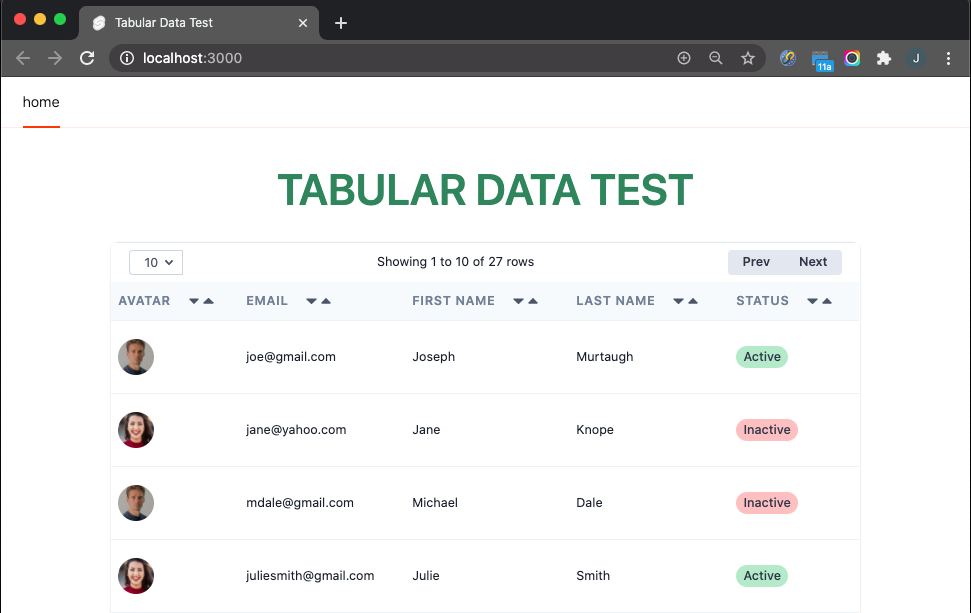

# tabular-svelte


## Overview

`tabular-svelte` provides a simple way to present data in a tabular format.
Its major functionality includes:

- Support for text, image, & pill components
- Forward & backward scrolling

These are the only functions available at this time. However, this is an 
active project and there are plans to add additional features over time.

## Installation

To install this package use the following NPM command:
> `npm install --save-dev tabular-svelte`

## Usage

All you have to do to use `tabular-svelte` is to create a
Javascript object defining where your data is coming from and 
the format of each cell in a column, and then include the `<Tabular>`
component in your markup.

### Format Object

The Javascript object you create is referred to as the "format"
object. You can name it anything you'd like and the following issues
an example of how it's formatted:
```
const personRpt = {
		dataSource: {
			reader: getPersonData,
			rowsPerPage: 4, // Specify -1 for all rows
			totalRows: PersonData.length,
		},
		columns: [
			{ type: 'image', heading: 'Avatar', dataName: 'avatarImg' },
			{ type: 'text', heading: 'email', dataName: 'email' },
			{ type: 'text', heading: 'Last Name', dataName: 'lastName' },
			{ type: 'text', heading: 'First Name', dataName: 'firstName' },
			{ type: 'pill', heading: 'Status', dataName: 'status',
					decorators: [ 
						{ value: 'Active', pillColor: 'bg-green-400' },
						{ value: 'Inactive', pillColor: 'bg-red-400' },
					]
			}
		]
	}
```

#### `dataSource` Section
`dataSource` defines a reference to a reader function that 
supplies the data rows, the number of rows to be displayed on 
each page, and the total number of rows provided by your reader 
function.

| Attribute | Value |
|:----------|:------|
| `reader`      | A function Tabular will invoke to get the rows to be displayed. This function should return all available rows and Tabular will figure out how to format them and allow the user to scroll through them them |
| `rowsPerPage` | The maximum number of rows to be displayed on the page. This also defines the number of rows that will be moved backward or forward during a scrolling operation. |
| `totalRows`   | The total number of rows in the JS object returned by `reader`. |

#### `columns` Section 
`columns` defines the format of the cells in each column. There are
are currently three format types:

- `text`: Plain text
- `image`: An image
- `pill`: Text styled in a color-filled oval

| Attribute      | Value |
|:---------------|:------|
| `type`         | May be one of the following to specify have values in this column will be formatted:<br/><br/>`text`: Plain text<br/>`image`: An image with a round border<br/>`pill`: Text value encolosed in a color-filled oval |
| `heading`      | The heading for this column |
| `dataName`     | Name of the key for this field in the JS object returned by the `reader` |
| `decorators`   | Specifies the background color to be applied to the cell. Currently this is only used on `pill` columns.<br/><br/>`value`:The data value the decorator will be applied to.<br/>`pillColor`: The background color to be used for `pill` columns. |

### Tabular Component

Once you've defined a format object all you need to do is include a
`<Tabular>` component as markup in your Svelte file like so:

```
<Tabular definition={ personRpt } />
```

That's it! Tabular will call the `reader` function you supply to get the data
and will then render it based using the `columns` specification you defined
in the format object. 

You can see an example in this [repo](https://github.com/jdmedlock/tabular-svelte-test).
## Support

If you have questions or encounter any issues feel free to 
[open an issue](https://github.com/jdmedlock/tabular-svelte/issues) and we will address it as soon as possible. 

Better yet, consider contributing to this project by proposing enhancements
and working on issues. You can find more information about contributing in
these project documents:

- [Code of Conduct](./docs/CODE_OF_CONDUCT.md)
- [Colaborator Guide](./docs/COLLABORATOR_GUIDE.md)
- [Contributing](./docs/CONTRIBUTING.md)

## Release History

You can find what changed, when in the [release history](./docs/RELEASE_HISTORY.md) 
## License

Copyright 2020 <COPYRIGHT Jim D. Medlock>

Redistribution and use in source and binary forms, with or without modification, are permitted provided that the following conditions are met:

1. Redistributions of source code must retain the above copyright notice, this list of conditions and the following disclaimer.

2. Redistributions in binary form must reproduce the above copyright notice, this list of conditions and the following disclaimer in the documentation and/or other materials provided with the distribution.

3. Neither the name of the copyright holder nor the names of its contributors may be used to endorse or promote products derived from this software without specific prior written permission.

THIS SOFTWARE IS PROVIDED BY THE COPYRIGHT HOLDERS AND CONTRIBUTORS "AS IS" AND ANY EXPRESS OR IMPLIED WARRANTIES, INCLUDING, BUT NOT LIMITED TO, THE IMPLIED WARRANTIES OF MERCHANTABILITY AND FITNESS FOR A PARTICULAR PURPOSE ARE DISCLAIMED. IN NO EVENT SHALL THE COPYRIGHT HOLDER OR CONTRIBUTORS BE LIABLE FOR ANY DIRECT, INDIRECT, INCIDENTAL, SPECIAL, EXEMPLARY, OR CONSEQUENTIAL DAMAGES (INCLUDING, BUT NOT LIMITED TO, PROCUREMENT OF SUBSTITUTE GOODS OR SERVICES; LOSS OF USE, DATA, OR PROFITS; OR BUSINESS INTERRUPTION) HOWEVER CAUSED AND ON ANY THEORY OF LIABILITY, WHETHER IN CONTRACT, STRICT LIABILITY, OR TORT (INCLUDING NEGLIGENCE OR OTHERWISE) ARISING IN ANY WAY OUT OF THE USE OF THIS SOFTWARE, EVEN IF ADVISED OF THE POSSIBILITY OF SUCH DAMAGE.